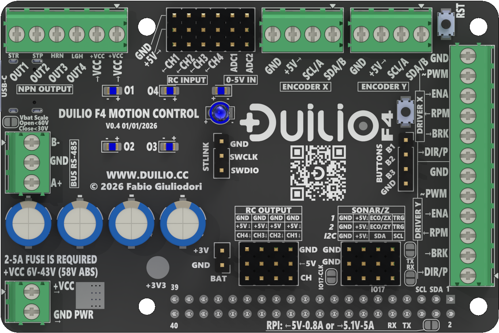
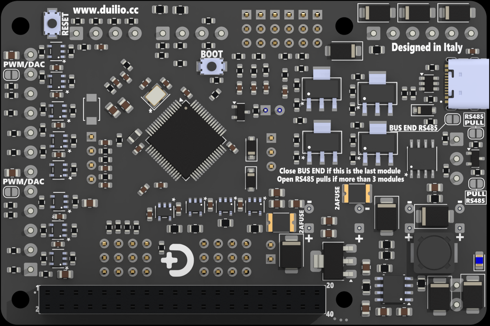

# DUILIO F4 Hardware Manual

This manual is the public hardware reference for DUILIO F4.
It is intended for system integrators, machine builders, and technical users who need to wire, power, configure, and install the board correctly.

This document focuses on user-facing hardware information:

- board role and intended use
- electrical characteristics and limits
- power architecture and connector reference
- simplified wiring concepts
- service and debug access available to the end integrator

This manual does not publish the full private hardware development package, production files, or internal compliance documentation.

---

## Board overview

### Top side

### Bottom side

---

## Chapter map

1. Introduction
2. Features and specifications
3. Safety precautions
4. Power system
5. Board overview
6. Connectors and pinout
7. Function and usage
8. Connection diagrams
9. Communication interfaces
10. Advanced hardware configuration
11. Debug and service
12. Appendices
