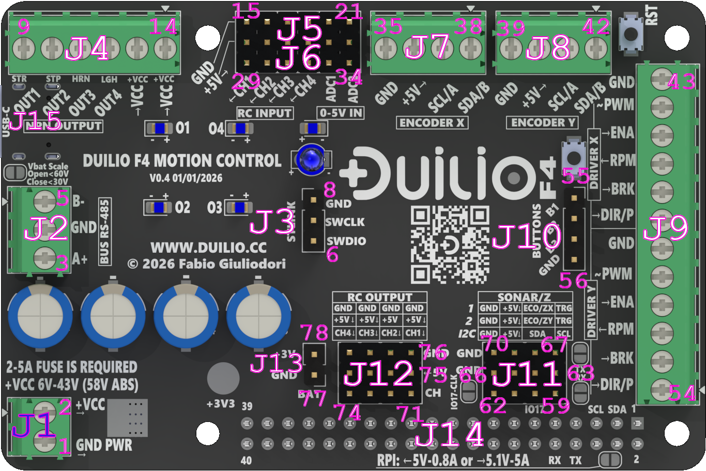

This section lists the external connectors of DUILIO F4 based on the current public pinout reference.
Pin numbering follows the board silkscreen and the latest workbook used as source for the public documentation.

Signal direction and practical integration notes are reported from the end-user point of view.
Electrical limits remain subject to the total current constraints of the board power system described in Chapter 4.

---

---

> NOTE: Power distribution and current limits (system-level)
> - Individual pin current ratings are maximum limits, not guarantees.
> - The sum of all output currents depends on the active power source.
> - When powered from VIN: total available 5 V current approx. 3 A continuous, 5 A peak (shared).
> - When powered ONLY from USB or Raspberry Pi GPIO: total available 5 V current < 0.8 A.
> - Exceeding the total budget may cause voltage drop, reset, or thermal shutdown.

### Connector J01 - Digital outputs and VIN distribution

| Pin | Silkscreen | Function | Notes |
| --- | --- | --- | --- |
| 1 | VIN OUT | VIN pass-through | Power rail, linked to VIN distribution |
| 2 | VIN OUT | VIN pass-through | Power rail, linked to VIN distribution |
| 3 | LAMP | LIGHTS output | Low-side digital output |
| 4 | SHOT | HORN output | Low-side digital output |
| 5 | STRT | MOTOR_ON output | Low-side digital output |
| 6 | SAFE | MOTOR_OFF output | Low-side digital output, intended safe-state related output |

### Connector J02 - RC inputs and analog inputs

| Pin | Silkscreen | Function | Notes |
| --- | --- | --- | --- |
| 1 | CH1 (RC_INPUT) | RC input channel 1 | Input, RC PWM style |
| 2 | CH2 (RC_INPUT) | RC input channel 2 | Input, RC PWM style |
| 3 | CH3 (RC_INPUT) | RC input channel 3 | Input, RC PWM style |
| 4 | CH4 (RC_INPUT) | RC input channel 4 | Input, RC PWM style |
| 5 | AI_L | Analog input left | Input, ADC |
| 6 | AI_R | Analog input right | Input, ADC |

### Connector J03 - I2C bus A

| Pin | Silkscreen | Function | Notes |
| --- | --- | --- | --- |
| 1 | SDA2/A | I2C data | Bidirectional logic signal |
| 2 | SCL2(A) | I2C clock | Bidirectional logic signal |
| 3 | 5V | 5 V auxiliary output | Shared 5 V rail |
| 4 | GND | Ground | Signal reference |

### Connector J04 - I2C bus B

| Pin | Silkscreen | Function | Notes |
| --- | --- | --- | --- |
| 1 | SDA1/B | I2C data | Bidirectional logic signal |
| 2 | SCL1/A | I2C clock | Bidirectional logic signal |
| 3 | 5V | 5 V auxiliary output | Shared 5 V rail |
| 4 | GND | Ground | Signal reference |

### Connector J05 - USB

| Contact | Silkscreen | Function | Notes |
| --- | --- | --- | --- |
| D- | USB- | USB FS DM | USB data |
| D+ | USB+ | USB FS DP | USB data |

### Connector J06 - Status LED

| Pin | Silkscreen | Function | Notes |
| --- | --- | --- | --- |
| 1 | GND(-) | LED cathode | LED reference |
| 2 | LED | Status LED drive | Digital output for onboard/user LED indication |

### Connector J07 - Motor driver interface

| Pin | Silkscreen | Function | Notes |
| --- | --- | --- | --- |
| 1 | DIR/P(L) | Right axis DIR or second PWM line | Logic output |
| 2 | BRK(L) | Right axis brake | Logic output |
| 3 | RPM (L) | Left axis RPM feedback | Digital input |
| 4 | ENA(L) | Right axis enable | Logic output |
| 5 | PWM (Y) | Right axis PWM command | PWM output |
| 6 | GND | Ground | Signal reference |
| 7 | DIR/P (L) | Left axis DIR or second PWM line | Logic output |
| 8 | BKR (L) | Left axis brake | Logic output |
| 9 | RPM (L) | Right axis RPM feedback | Digital input |
| 10 | ENA(L) | Left axis enable | Logic output |
| 11 | PWM(X) | Left axis PWM command | PWM output |
| 12 | GND | Ground | Signal reference |

### Connector J08 - RS485

| Pin | Silkscreen | Function | Notes |
| --- | --- | --- | --- |
| 1 | B- | RS485 line B | Differential serial line |
| 2 | GND | Ground | Signal reference |
| 3 | A+ | RS485 line A | Differential serial line |

### Connector J09 - SWD programming and service

| Pin | Silkscreen | Function | Notes |
| --- | --- | --- | --- |
| 1 | GND | Ground | Service reference |
| 2 | SWCLK | SWD clock | 3.3 V debug/programming signal |
| 3 | SWDIO | SWD data | 3.3 V debug/programming signal |

### Connector J10 - Local buttons and safe inputs

| Pin | Silkscreen | Function | Notes |
| --- | --- | --- | --- |
| 1 | B0 | Button 0 | Digital input |
| 2 | S1 | Safe input 1 | Digital input |
| 3 | S2 | Safe input 2 | Digital input |
| 4 | GND | Ground | Signal reference |

### Connector J11 - Main power input

| Pin | Silkscreen | Function | Notes |
| --- | --- | --- | --- |
| 1 | VIN 7-43V | Main supply input | Input, VIN range 7-43 V |
| 2 | GNDPWR2 | Power ground | Main power return |

### Connector J12 - RC outputs and auxiliary 5 V / GND distribution

| Pin | Silkscreen | Function | Notes |
| --- | --- | --- | --- |
| 1 | nc | Not connected | Reserved |
| 2 | nc | Not connected | Reserved |
| 3 | CH1 (RC_OUTPUT) | RC output channel 1 | PWM output |
| 4 | CH2 (RC_OUTPUT) | RC output channel 2 | PWM output |
| 5 | CH3 (RC_OUTPUT) | RC output channel 3 | PWM output |
| 6 | CH4 (RC_OUTPUT) | RC output channel 4 | PWM output |
| 7 | AUX | 5 V servo/auxiliary rail | Shared auxiliary 5 V |
| 8 | AUX | 5 V servo/auxiliary rail | Shared auxiliary 5 V |
| 9 | AUX | 5 V servo/auxiliary rail | Shared auxiliary 5 V |
| 10 | AUX | 5 V servo/auxiliary rail | Shared auxiliary 5 V |
| 11 | AUX | 5 V servo/auxiliary rail | Shared auxiliary 5 V |
| 12 | AUX | 5 V servo/auxiliary rail | Shared auxiliary 5 V |
| 13 | GND | Ground | Signal reference |
| 14 | GND | Ground | Signal reference |
| 15 | GND | Ground | Signal reference |
| 16 | GND | Ground | Signal reference |
| 17 | GND | Ground | Signal reference |
| 18 | GND | Ground | Signal reference |

### Connector J13 - Sensor channel 1

| Pin | Silkscreen | Function | Notes |
| --- | --- | --- | --- |
| 1 | ECO1 | Echo input 1 | Digital input |
| 2 | TRG1 | Trigger output 1 | Digital output |
| 3 | 5V | Auxiliary 5 V | Sensor supply |
| 4 | GND | Ground | Signal reference |

### Connector J14 - Sensor channel 2

| Pin | Silkscreen | Function | Notes |
| --- | --- | --- | --- |
| 1 | ECO2 | Echo input 2 | Digital input |
| 2 | TRG2 | Trigger output 2 | Digital output |
| 3 | 5V | Auxiliary 5 V | Sensor supply |
| 4 | GND | Ground | Signal reference |

### Connector J15 - Raspberry Pi / host serial and service header

| Pin | Silkscreen | Function | Notes |
| --- | --- | --- | --- |
| 8 | RX (RPI) | Host RX line | Serial interface pin |
| 10 | TX(RPI) | Host TX line | Serial interface pin |
| 11 | CLK | Debug or service clock output | Digital output |

### Switch SW - Boot configuration

| Position | Silkscreen | Function | Notes |
| --- | --- | --- | --- |
| 1 | BOOT | BOOT0 | Service / recovery use only |
